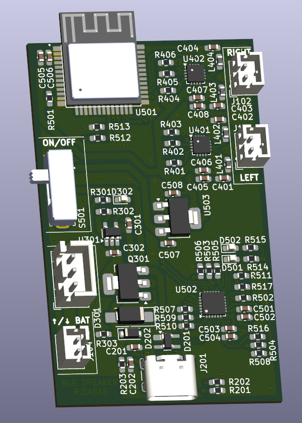
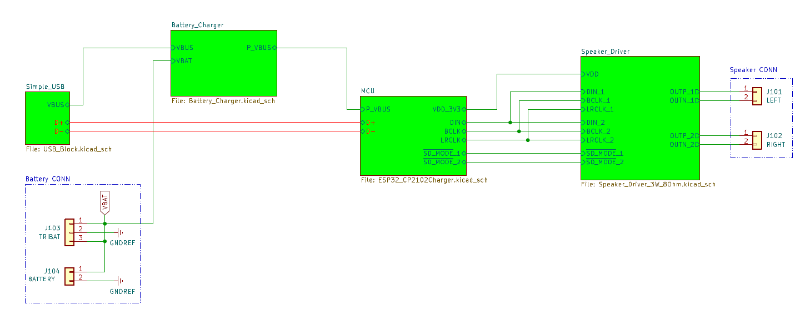
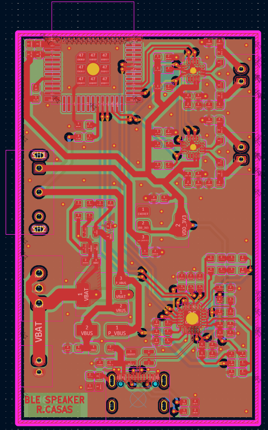

# 🔊 PCB_BLE_Speaker  
**BLE Audio + USB-C Rechargeable Speaker Board**

---

## 📘 Overview
**PCB_BLE_Speaker** is a compact **BLE audio speaker board** designed in **KiCad 9**, focused on learning about **USB-C**, **battery-powered systems**, **rechargeable devices**, and **audio amplifier integration**.  
The project explores practical design decisions such as **battery connectors**, **charging circuits**, **power protection**, and **audio MCU layout constraints**.

It includes two **MAX98357A** audio MCUs to experiment with both **mono** and **stereo firmware**, and was created as an exercise in **DFM/DFA**, power routing, and EMC-aware PCB design.

  
   
  <em>3D render of the PCB_BLE_Speaker board</em>

---

## ⚙️ General Information
- Designed in **KiCad 9** as a learning platform for:
  - USB-C 2.0 (5 V / 1 A)
  - Battery-powered systems
  - Rechargeable device architecture  
- Includes **two battery connectors**:  
  - One for a battery already owned  
  - One for a **standard battery connector** planned for purchase  
- Created to better understand **power protection**, **charging ICs**, and **audio layout constraints**.
- Built on a **4-layer PCB**, as recommended for the **MAX98357A** for better reliability, noise control, and ground integrity.
- All components intentionally placed on the **top layer** as a DFA/DFM exercise.

  
   
  <em>Schematic (KiCad 9)</em>

---

## 🔊 Characteristics
- **USB-C 2.0** input supplying **5 V up to 1 A**.  
- **MCP73831-2-OT** Li-Ion charger with a **5 kΩ PROG resistor**, giving a safe **200 mA charge current** — chosen to reduce thermal risks since no temperature monitoring system is implemented.  
- **MOSFET protection circuitry** between USB-C and charger to manage correct power flow and avoid dangerous battery–USB backfeed conditions.  
- **Two MAX98357A audio MCUs** included:
  - Allows experimenting with **mono** and **stereo** BLE audio firmware.
- Intended for **battery operation**:
  - A DC/DC regulator would have improved efficiency, but was intentionally discarded for version 1 for simplicity.
- Observed layout improvement for next revision:
  - Placing **audio amplifier + charger + power supply** side by side to reduce **current loop area**, improving **EMC/EMI** behavior and reducing high-current noise.

  
   
  <em>PCB layout design</em>

---

## ⚠️ Known Issues / Notes
- Power architecture can be improved by using a **buck DC/DC converter** for better efficiency during battery operation.  
- Current loops of the audio + charger power path could be optimized by placing related components closer.  
- Future improvements should include:
  - Better **EMI loop minimization**  
  - Dedicated copper pours for high-current paths  
  - Additional filtering  
- Placement of both audio MCUs on the top layer made routing more challenging, but was kept intentionally as a DFM/DFA practice exercise.

---

## 🧩 Files and Structure

  

PCB_BLE_Speaker/
├── schematic/
├── pcb_layout/
├── gerbers/
├── images/
├── LICENSE
└── README.md

---

## 📜 License
This hardware design is released under the **CERN Open Hardware License v2 – Permissive (CERN-OHL-P-2.0)**.  
You may use, modify, and redistribute the design, as long as:
- You include the license in redistributions.
- You give proper credit to the original author.

---

## 👤 Author
**Project:** PCB_BLE_Speaker  
**Author:** Kolicks  
**Toolchain:** KiCad 9  
**Version:** 1.0  

---

## 🧱 Future Improvements
- **Power Efficiency**
  - Add a **buck DC/DC converter** to improve battery runtime and reduce heat.  
- **EMI-Aware Layout**
  - Place **charger + power supply + audio MCUs** adjacently to shrink high-current loops.  
- **User Indicators**
  - Add **charging, power, and battery status LEDs**.  
- **Battery Protection**
  - Add optional **NTC thermistor** for thermal monitoring.  
- **Usability**
  - Improve connector positioning and silkscreen clarity.  

---

⭐ *If this project interests you, feel free to star the repository or contribute with suggestions!*
